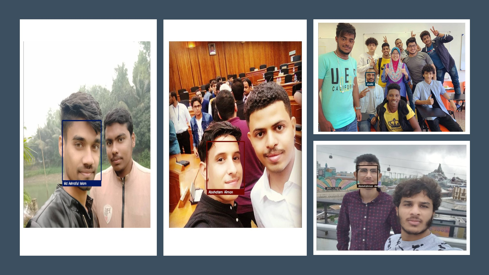

# Face Recognition (For Security System)

## A. PROJECT SUMMARY

**Project Title:** Face Recognition (For Security System)

**Team Members:** 
- [Md Ashraful Islam B032020050 ]
- [Khalid Ali Farah  B032020051]
- [Abdulrahman derhem  B031910490]
- [Jurham Rahman  B031920506]
- [Abohatem Aiman  B031920508 ]

## *. PROJECT OBJECTIVES 
Despite of there are many similar products are available in the market, however there are still a lot of improvement can be done. The objectives of this project are: 

1.To design and develop an anti-theft security system which is portable, high efficiency, low cost and easy to operate. 

2.To detect the present of person when he or she reach in front the door and the face recognizer will recognize owner face. 

3.To notify owner and start surveillance system in real time when stranger detected. 

4.To record the door access about time, user and locker status. 

5.To have door access time restrictions.

##  B. ABSTRACT 

Today’s institutions are facing major security issues; consequently, they need several specially trained personnel to attain the desired security. These personnel, as human beings, make mistakes that might affect the level of security. 
A proposed solution to the mentioned matter is a Face Recognition Security System, which can detect intruders to restricted or high - security areas and help in minimizing human error.
This project is about an anti-theft security system using face recognition based on Raspberry pi. Anti-theft security system has been launched for many years but most of them are just a CCTV, IP camera or door sensor alert system. It could be more efficient with uses of face recognition. The design of anti-theft security system is based on human face recognition and remote monitoring technology. It will verify the person identity that goes near to the camera within certain distance. Only the people who match the identity with database and key in the correct password have the right to entry. A mobile application telegram and image processing technique LBP based have been involved in this system. Electric door lock solenoid, keypad and LCD display will combined operate the accessibility of door. An ultrasonic sensor is used to detect the person distance between the door. Face recognition will only start to function when someone goes near the door within certain distance. An alert message and photo taken will send to owner mobile phone via telegram with WIFI when the face recognition algorithms detect a stranger comes near the door and also a buzzer will be triggered to act as an alarm system. Owner can control the door locker and check the camera with the telegram application. The security system is designed for actual use in home condition with the uses of a microcontroller ARM Quad Cortex-A53.

Figure 1 shows the AI intput of detecting face .

Figure 2 shows the AI output of detecting who are real people. 

## C. DATASET
 COMING SOON

## D. PROJECT STRUCTURE
COMING SOON

## E.  RESULT AND CONCLUSION 

This project is used to implement the face recognition and the house security. Face recognition nowadays has been widely used on many areas especially on security. The house security can be improved with the implement of this product. It is design with low cost and efficient material. The improvement of technology had made the internet of thing no longer an expensive stuff and it can be modified and customized depend on our needs. 
The system security on market with low budget have the problem like the face detection only will start to function when someone press the doorbell. Surveillance system will destroy by theft and without notify owner when stranger come in. Face recognition can be passed with owner face photo. Unable to unlock the door without key. 
The motivation is to develop a low-cost security system to solve the issues exist on market product. A self-develop anti-theft security system using face recognition project have been started for solve the above issues. It can help to solve the issues like it can trigger the alarm and capture an image send to owner when a stranger is detected in front of door. The theft will get alert so he got no time to start breaking the door and destroy the security system. For overcome the weakness of face recognition that can be passed with owner face image so the door will only unlock with the correct password input with a keypad. Besides, it also has features like remote access control, reverse password, door access records and time restriction control. 
Appropriate hardware and software are used as they are the crucial component to make this project. The hardware used is Raspberry Pi 3 model B which is main hardware, connected to several sensors and also connected to the Telegram mobile application. This project uses Python, Shell script, JavaScript programming language. Some Linux command prompt is also used while installing the drivers or library for the Python coding. 
Moreover, this project contents consist several features, draft ideas, researches information and methodology about the Anti-theft security system using face recognition.
There are many difficulties found such as understanding the project features, studying the limited case study related to this project and thinking about the basic structure and design of the system which make whole progress did not run smoothly. However, I still managed to solve it finally. During the process of doing the proposal, the hardware part and software part is categorized separately and then do research about the necessary component needed and its function involved in this project. 
Finally, with the proper guidance and advice from lecturer, supervisor and also the research on previous products that had been studied, this project has been successfully completed in more efficiency way.

## F.   PROJECT PRESENTATION   

